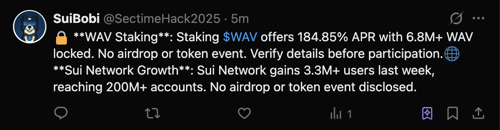

# SUI BOBI: AI-Powered Intelligence Dog & Meme Coin for the SUI Ecosystem

    

[Twitter](https://x.com/SectimeHack2025) 𝕏 | [Documentation](https://docs.google.com/presentation/d/1NkfXmz3i9oofgHAdzOU6U_QLA4uY2wPO/edit?usp=drive_link&ouid=101678135022246621628&rtpof=true&sd=true) 📜 | [Demo](https://drive.google.com/file/d/1nWNBhW-u-9jdRZxuYXuw-UoBKFSwWHUm/view?usp=drive_link) 📹 | [Chinese Version](./README_CN.md) 🇨🇳

## 1. Background: Opportunities Lost in an Information Deluge

The Sui mainnet is expanding at high speed. TGEs, aidrops, and new projects emerge almost daily, yet:
- Signal-to-noise is low : valuable updates drown in social-media chatter.
- Users struggle to react in time and routinely miss Alpha or airdrop windows.

## 2. Inspiration: Let a Dog “Sniff Out” Your Alpha
“What if a dog could fetch only the juiciest intel for you?” 

Enter **SuiBobi** —

- An AI Twitter bot powered by ElizaOS.
- Monitors Sui on-chain data & social feeds 24/7, auto-filters high-value info.
- Personified as a clever border collie in swim goggles that dives into the data ocean and resurfaces with the tastiest bones (Alpha). 

## 3. Three Stand-Out Features of SuiBobi
| Feature | Benefit | Notes |
|---------|---------|-------|
|Full-Scope Monitoring | Captures real-time TGEs, airdrops, hack alerts| Multi-source parsing via ElizaOS |
|Auto Summaries | Distills key points, prevents info overload | “Three retweets → one summary” cadence |
Humanized Meme Presence | Border-collie avatar + meme culture | Boosts engagement and reach |

## 4. $BOBI: Giving a Meme Coin Real Purpose

Beyond intel, SuiBobi issues **$BOBI**:
- The token powers ecosystem incentives and community governance.
- Embraces meme culture to drive viral growth.
- Detailed tokenomics will appear in an upcoming white-paper. 

[**Token Info**](https://suiscan.xyz/mainnet/object/0x7a9f79c826a1b21f7ada3ec14c7de16ec4ac3eb46aaed9e7e3e20eff87a33d4b/fields):
- Total Supply: 233 million (inspired by the total amount stolen in the Cetus hack)
- Decimal Places: 7 (a nod to the remaining protected funds during the Cetus exploit)
- Future Issuance Plan: IDO
- As a meme coin, the majority of tokens will be redistributed to the community.

## 5. Tech
- Tech Stack: TypeScript ｜ Eliza v0.25.9 🤖
- Data Source: RootData
- Platforms: Twitter ｜ Phala Network

The original Eliza Twitter Plugin has been enhanced with the following features:
1. **@Mention Detection**: Automatically detects when users mention the bot. If the content meets SuiBobi’s criteria, it will be retweeted.
2.	**Real-Time Project Feeds**: Fetches Twitter accounts of projects in the Sui ecosystem from RootData to access first-hand updates.
3.	**Built-in Filtering**: Only posts that pass the filtering logic will be eligible for retweeting.
4.	**Auto-Summary Feature**: For every 3 retweets, the bot will automatically post a summary tweet covering those 3 posts.

## 6. How to Join the SuiBobi Movement
1. Follow @SuiBobi on Twitter for instant updates.
2. Join community chat, share valuable intel or creative memes.
3. During the public sale, hold or stake $BOBI to earn early-stage rewards. 

**Early Participation Incentives**:
- Users who post about Sui-related projects, mention @SecTimeHack2025, and get retweeted by SuiBobi will earn the most points.
- Users who like, comment, and retweet SuiBobi’s posts will earn the second-highest amount of points.
- After the snapshot, early user roles will be distributed based on the points earned.

## 7. Vision & Call to Action
SuiBobi aims to be **“the most reliable Alpha supplier on Sui.”**
- Save users’ time and flatten the learning curve.
- Leverage meme culture for wider impact, feeding value back into the ecosystem.
- Collaborate with devs and projects to build a more transparent, efficient Sui info network. 

----
Presented by SecTime Hack — Sui Overflow Team
