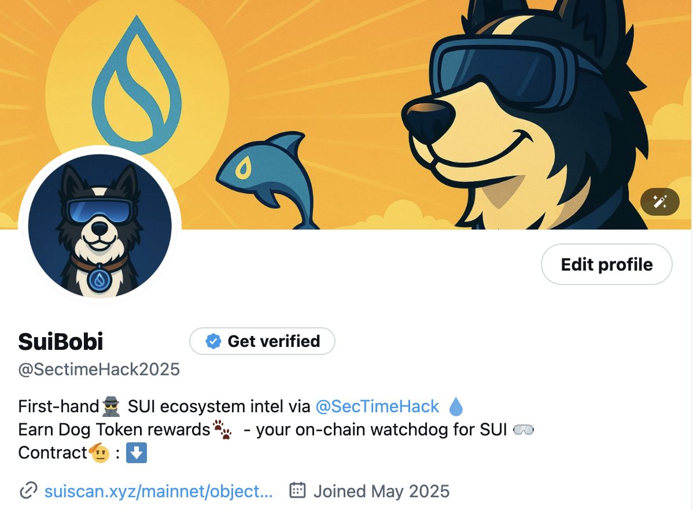

# SuiBobi：AI 驱动的 Sui 生态情报犬 & Meme Coin

    

[Twitter](https://x.com/SectimeHack2025) 𝕏 | [Documentation](https://docs.google.com/presentation/d/1NkfXmz3i9oofgHAdzOU6U_QLA4uY2wPO/edit?usp=drive_link&ouid=101678135022246621628&rtpof=true&sd=true) 📜 | [Demo](https://drive.google.com/file/d/1nWNBhW-u-9jdRZxuYXuw-UoBKFSwWHUm/view?usp=drive_link) 📹 | [English Version](./README.md) 🏴󠁧󠁢󠁥󠁮󠁧󠁿

## 1. 背景：信息洪流中的机会错失
Sui 主网迅速扩张，TGE、空投与新项目层出不穷，但
- 信号-噪声比过低，关键资讯常被海量噪音掩埋；
- 用户难以及时跟进，错过潜在 Alpha 与空投机会。 

## 2. 灵感：让一只狗帮你“嗅”出 Alpha
“如果有条狗能把最关键的情报都叼回来呢？” 

团队因此构想 **SuiBobi** ——
- 以 ElizaOS 为核心的 AI Twitter Bot；
- 24/7 监听 Sui 链与社媒动态，自动筛选并推送高价值信息；
- 角色设定为 戴泳镜的聪明边牧——能潜入数据海洋，叼回最香的骨头（Alpha）。 

## 3. SuiBobi 的三大亮点
| 功能 | 价值 | 备注 |
|-----|-----|-----|
| **全域监控** | 捕捉 TGE、空投、黑客警报等实时事件 | 基于 ElizaOS 多源解析 |
| **自动摘要** | 降噪提炼关键信息，避免信息轰炸 | “三转推一摘要”节奏 |
| **社区拟人化** | 边牧形象 + Meme 文化，降低学习门槛 | 提升互动与传播效率 |

## 4. $BOBI：赋予 Meme Coin 真正的意义
除了情报服务，SuiBobi 还发行 **$BOBI**：
- 作为生态激励与社区治理的通证；
- 同时承载 Meme 文化，增强病毒式传播；
- 具体经济模型将在后续白皮书中披露。 

[代币信息](https://suiscan.xyz/mainnet/object/0x7a9f79c826a1b21f7ada3ec14c7de16ec4ac3eb46aaed9e7e3e20eff87a33d4b/fields)：
- 总供应量：233million（灵感来自于Cetus被盗总数量）
- 小数点：7位（这是因为Cetus被盗事件所被保护的剩余）
- 未来发行计划：IDO
- 由于是meme coin，所以大部分的代币都会回馈给用户

## 5. 技术
- 技术栈： Typescript ｜ Eliza v0.25.9 🤖 
- 数据来源： RootData
- 平台：Twitter ｜ Phala Network

对原始的 Eliza Twitter 插件进行了以下功能增强：
1.	**@提及检测功能**： 自动检测用户是否提及机器人，如果内容符合 SuiBobi 的标准，将自动转发该推文。
2.	**实时项目信息抓取**： 从 RootData 获取 Sui 生态中的项目 Twitter 账号，第一时间掌握动态。
3.	**内置筛选机制**： 仅对通过筛选逻辑的内容进行转发。
4.	**自动总结功能**： 每转发 3 条推文，自动发布一条总结这 3 条内容的推文。

## 6. 如何加入 SuiBobi 运动
1. 关注 Twitter 账号 @SuiBobi，第一时间获取推送；
2. 参与社区讨论，贡献优质情报或创意 Meme；
3. 在公开发售阶段持有/质押 $BOBI，享受早期激励。

具体早期激励分配：

- 用户本身写关于Sui项目相关内容并且@SecTimeHack2025并且被SuiBobi转发的话，既可以获得更多积分。
- 用户点赞、留言以及转发SuiBobi的帖子，既可以获得第二多积分。
- 快照后，会根据用户积分分发相应的早期用户身份。

## 7. 愿景与行动号召
- SuiBobi 致力于成为 “Sui 链上最可靠的 Alpha 供应商”：
- 为用户节省时间，降低学习曲线；
- 通过 Meme 文化扩大影响力，反哺生态；
- 与开发者、项目方共建更透明、高效的 Sui 信息网络。 

---
Presented by SecTime Hack — Sui Overflow Team
